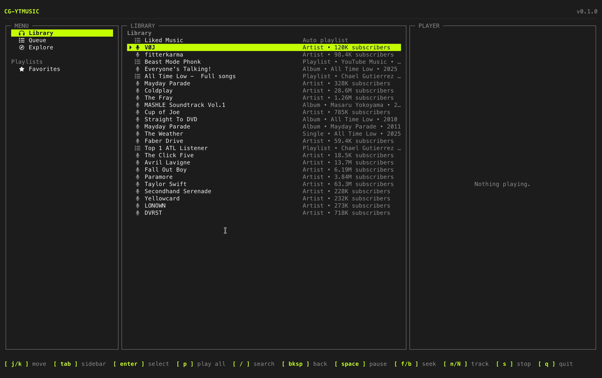

# cg-ytmusic

A terminal music player for YouTube Music, built with [Ink](https://github.com/vadimdemedes/ink).
Signs in with your real Google account, browses your library/playlists/artists,
searches, and plays audio through [mpv](https://mpv.io), with autoplay-next through a
queue.

[](https://github.com/michaeljymsgutierrez/cg-ytmusic/actions/workflows/ci.yml)
[](LICENSE)
[](package.json)

## Demo



## Contents

- [Features](#features)
- [Quick start](#quick-start)
- [Requirements](#requirements)
- [Install](#install)
- [Sign-in](#sign-in)
- [Keybindings](#keybindings)
- [Development](#development)
- [Contributing](#contributing)
- [License](#license)

## Features

- **Real account sign-in** - your actual library, playlists, and likes, not just public
  search.
- **Browse** - library, playlist tracklists, and artist pages (top songs, singles,
  videos, related artists).
- **Search** - songs, videos, playlists, albums, and artists.
- **Queue + autoplay** - opening a song mid-playlist queues it plus the rest of the
  playlist in order; the next queued track starts automatically when one ends. `p` on
  a playlist/album/artist queues its whole tracklist (or an artist's top songs) at once.
- **Full transport controls** - play/pause, stop, seek, next/prev queued track.

## Quick start

Requires Node.js >= 18, [mpv](https://mpv.io), and [yt-dlp](https://github.com/yt-dlp/yt-dlp)
on your `PATH`.

```bash
brew install mpv yt-dlp   # macOS; see Requirements below for other platforms

git clone https://github.com/michaeljymsgutierrez/cg-ytmusic.git
cd cg-ytmusic
pnpm install
pnpm dev
```

On first run it walks you through sign-in (see [Sign-in](#sign-in) below). See
[Keybindings](#keybindings) for the controls once you're in.

## Requirements

- Node.js >= 18 and [pnpm](https://pnpm.io).
- [mpv](https://mpv.io) - does the actual audio playback.
  - macOS: `brew install mpv`
  - Debian/Ubuntu: `apt install mpv`
  - Windows: `winget install mpv` (or see mpv's site)
- [yt-dlp](https://github.com/yt-dlp/yt-dlp) - resolves a playable stream URL per track.
  - macOS: `brew install yt-dlp`
  - Debian/Ubuntu: `apt install yt-dlp` (or `pip install yt-dlp` for a newer version)
  - Windows: `winget install yt-dlp`

`cg-ytmusic` checks for both on startup and exits with an install hint if either is
missing.

## Install

### From source

```bash
git clone https://github.com/michaeljymsgutierrez/cg-ytmusic.git
cd cg-ytmusic
pnpm install
pnpm build
pnpm start
```

During development, run it straight from source without building:

```bash
pnpm dev
```

### As a global command (pnpm/npm link)

To run `cg-ytmusic` from anywhere as a real global command (not just `pnpm start` from
inside the repo), link the built package instead of publishing it:

```bash
pnpm build
pnpm link      # registers this checkout's `cg-ytmusic` bin globally

cg-ytmusic --version
```

or with npm:

```bash
npm run build
npm link       # same idea, via npm's global link

cg-ytmusic --version
```

To remove the global command again:

```bash
pnpm rm -g cg-ytmusic      # pnpm - plain `pnpm unlink` does NOT remove a global link
                           # (it reports "Nothing to unlink" and leaves the command in
                           # place); `pnpm rm -g` is what actually works
# or
npm unlink -g cg-ytmusic   # npm
```

Both point the global `cg-ytmusic` command at this checkout's `dist/cli.js` (see the
`bin` field in `package.json`) - rebuilding (`pnpm build`) updates what the linked
command runs without needing to link again.

## Sign-in

`cg-ytmusic` signs in with a YouTube session cookie rather than OAuth - youtubei.js's
OAuth device-code flow currently returns HTTP 400 on nearly every data call due to a
still-open upstream bug ([YouTube.js#916](https://github.com/LuanRT/YouTube.js/issues/916)),
so cookie auth is what actually works today for real account access.

On first run (or whenever the cookie expires), the app walks you through it:

1. Sign in at [music.youtube.com](https://music.youtube.com) in a browser.
2. Open DevTools -> Network, reload the page, and click any `youtubei/v1` request.
3. Copy that request's `Cookie` header **value** (not the whole request, just the
   cookie string).
4. Paste it into the app and press enter.

The cookie is cached to `~/.config/cg-ytmusic/cookie.txt` and reused automatically on
future launches - you only need to do this again once it expires.

> **Security note:** do not paste the full request headers or the `authorization` line
> anywhere outside the app's own prompt - the `Cookie` header carries your live Google
> session credentials (equivalent to being logged in), so treat it like a password. See
> [SECURITY.md](SECURITY.md) for how this project handles it and how to report a
> vulnerability.

## Keybindings

| Key | Action |
|-----|--------|
| `j` / `k` or arrows | Move selection up/down |
| `enter` | Open a playlist/artist, or play a selected song |
| `p` | Queue and play a whole playlist/album/artist |
| `/` | Search |
| `backspace` / `esc` | Go back |
| `space` | Play/pause |
| `f` / `→` | Seek forward 10s |
| `b` / `←` | Seek backward 10s |
| `n` / `N` | Next / previous track in the queue |
| `s` | Stop |
| `q` | Quit |

## Development

```bash
pnpm dev          # run from source with tsx
pnpm typecheck    # tsc --noEmit
pnpm test         # vitest - unit tests for hooks, components, and core logic
pnpm build        # compile to dist/
```

## Contributing

Contributions are welcome - see [CONTRIBUTING.md](CONTRIBUTING.md) for dev setup,
project layout, code style, and commit/branch conventions. Please also read the
[Code of Conduct](CODE_OF_CONDUCT.md).

## License

[MIT](LICENSE) © Michael Jyms Gutierrez
